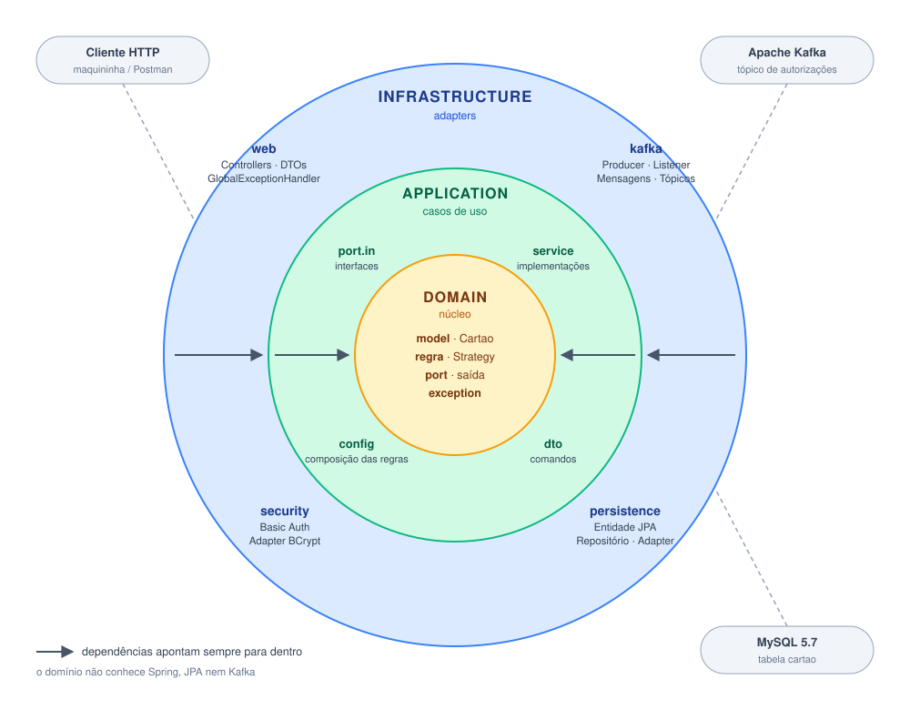
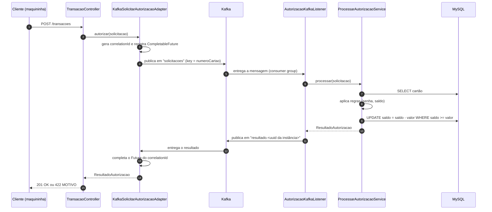

# Mini Autorizador — Documentação da Implementação

Este documento descreve as decisões técnicas da solução: arquitetura, fluxo com Kafka,
persistência, tratamento de concorrência, segurança, testes e as suposições assumidas
onde o enunciado ([README.md](README.md)) deixou espaço para interpretação.

## Sumário

1. [Visão geral](#1-visão-geral)
2. [Stack](#2-stack)
3. [Como executar](#3-como-executar)
4. [Arquitetura (Clean Architecture / Hexagonal)](#4-arquitetura-clean-architecture--hexagonal)
5. [Fluxos de negócio](#5-fluxos-de-negócio)
6. [Kafka](#6-kafka)
7. [Banco de dados](#7-banco-de-dados)
8. [Concorrência](#8-concorrência)
9. [Regras de autorização sem `if`](#9-regras-de-autorização-sem-if)
10. [Segurança](#10-segurança)
11. [Tratamento de erros](#11-tratamento-de-erros)
12. [Testes](#12-testes)
13. [Configuração](#13-configuração)
14. [Suposições e decisões](#14-suposições-e-decisões)

---

## 1. Visão geral

Aplicação Spring Boot com interface REST que permite:

| Operação                              | Endpoint                        | Sucesso                   | Falhas                                                                           |
| --------------------------------------- | ------------------------------- | ------------------------- | -------------------------------------------------------------------------------- |
| Criar cartão (saldo inicial R$ 500,00) | `POST /cartoes`               | `201` + JSON do cartão | `422` cartão já existe                                                       |
| Consultar saldo                         | `GET /cartoes/{numeroCartao}` | `200` + saldo           | `404` cartão inexistente                                                      |
| Autorizar transação                   | `POST /transacoes`            | `201` + `OK`          | `422` + `SALDO_INSUFICIENTE` \| `SENHA_INVALIDA` \| `CARTAO_INEXISTENTE` |

Todos os endpoints exigem autenticação HTTP Basic (`username` / `password`); sem ela a resposta é `401`.

## 2. Stack

| Tecnologia                | Uso                                                                     |
| ------------------------- | ----------------------------------------------------------------------- |
| Java 21                   | Linguagem (records, pattern matching em `equals`)                      |
| Spring Boot 3.3.4         | Framework principal (Web, Validation, Security, Data JPA, Actuator)     |
| Maven                     | Build e gerenciamento de dependências                                  |
| MySQL 5.7                 | Banco relacional (declarado no `docker-compose.yml` original)          |
| Apache Kafka 3.7 (KRaft)  | Processamento assíncrono das autorizações                            |
| Spring Kafka              | Producer/consumer com serialização JSON                               |
| BCrypt (Spring Security)  | Hash da senha do cartão                                                |
| JUnit 5, Mockito, AssertJ | Testes unitários e de integração                                     |
| H2 + `@EmbeddedKafka`    | Infraestrutura em memória para os testes de integração e aceitação |
| Testcontainers 1.21       | MySQL 5.7 e Kafka 3.7 reais em containers para os testes E2E            |
| ArchUnit                  | Verificação automática das regras de camadas                         |
| JaCoCo                    | Cobertura de testes (mínimo exigido no build: 80% de linhas)           |

## 3. Como executar

### Pré-requisitos

- **JDK 21** (o `pom.xml` compila com `release 21`)
- Maven 3.9+
- Docker (ou Podman) com Compose

> **Ambiente validado:** OpenJDK **21.0.12** + Maven 3.9.12 + Podman, no Ubuntu.
> É preciso ter o **JDK** instalado (ex.: `openjdk-21-jdk`), e não apenas o JRE: com um JRE
> mais novo como `java` padrão (ex.: JRE 25, sem compilador), o build falha com
> `release version 21 not supported`. Nesse caso, aponte o `JAVA_HOME` para o JDK 21.

### Subindo a infraestrutura e a aplicação

```bash
# 1. MySQL + Kafka
docker compose up -d

# 2. Aplicação (porta 8080)
mvn spring-boot:run
```

Para encerrar a aplicação, pressione `Ctrl+C` no terminal onde ela está rodando. Se ela foi
iniciada em segundo plano, ou se a subida falhar com `java.net.BindException: Endereço já em uso`
(`Address already in use`) porque outra instância ainda ocupa a porta 8080:

```bash
ss -ltnp | grep 8080                # mostra qual processo está usando a porta
pkill -f MiniAutorizadorApplication # encerra a instância em execução
```

Para parar também o MySQL e o Kafka, veja [Parando a aplicação e a infraestrutura](#parando-a-aplicação-e-a-infraestrutura).

O banco `miniautorizador` e a tabela `cartao` são criados automaticamente
(`createDatabaseIfNotExist=true` + `ddl-auto: update`). O tópico Kafka de solicitações também
é criado automaticamente na subida.

Verificação de saúde (não exige autenticação):

```bash
curl http://localhost:8080/actuator/health
```

### Parando a aplicação e a infraestrutura

**Aplicação:** pressione `Ctrl+C` no terminal onde o `mvn spring-boot:run` está rodando.
Se ela foi iniciada em segundo plano (sem terminal associado):

```bash
pkill -f MiniAutorizadorApplication
```

**MySQL e Kafka:**

```bash
# pausa os containers, mantendo os dados (cartões e saldos)
docker compose stop

# retoma os containers pausados
docker compose start

# remove os containers - APAGA os dados do MySQL
docker compose down
```

> O `docker-compose.yml` não declara volume para o MySQL. Por isso, o `down` descarta todos os
> cartões criados: na próxima subida, o banco começa vazio. Use `stop`/`start` para preservá-los.

### Coleção do Postman

O projeto inclui uma coleção pronta para testar a aplicação manualmente:
[`postman/vrBeneficios.postman_collection.json`](postman/vrBeneficios.postman_collection.json).

Para usá-la, no Postman clique em **Import** e selecione (ou arraste) o arquivo. A coleção
**vrBeneficios** aparece com três requisições, já apontando para `http://localhost:8080` e com a
autenticação Basic (`username` / `password`) configurada:

| Requisição                 | Método e endpoint              | Corpo de exemplo                             |
| ---------------------------- | ------------------------------- | -------------------------------------------- |
| `criar_novo_cartao`        | `POST /cartoes`               | `numeroCartao`, `senha`                  |
| `realizar_uma_transação` | `POST /transacoes`            | `numeroCartao`, `senhaCartao`, `valor` |
| `obter_saldo_cartão`      | `GET /cartoes/{numeroCartao}` | —                                           |

Com a aplicação no ar, envie as requisições nesta ordem: criar o cartão, consultar o saldo,
realizar transações e consultar o saldo de novo. Use o mesmo `numeroCartao` em todas elas
(no corpo das duas primeiras e na URL da consulta de saldo). Para ver as recusas do contrato,
altere o corpo da transação: `senhaCartao` errada (`SENHA_INVALIDA`), número de cartão
inexistente (`CARTAO_INEXISTENTE`) ou valor acima do saldo (`SALDO_INSUFICIENTE`).

### Testes

```bash
mvn verify
```

Executa todos os testes (unitários, integração, aceitação, concorrência, arquitetura e E2E), gera o
relatório de cobertura em `target/site/jacoco/index.html` e falha o build se a cobertura de
linhas ficar abaixo de 80%. Nenhum teste depende do docker-compose: os de integração usam H2 e
Kafka embarcado, e os E2E sobem seus próprios containers via Testcontainers.

Os testes E2E precisam de Docker ou Podman acessível. **Sem ele, são pulados (não falham)**, e o
restante da suíte roda normalmente. Com Podman, exporte o socket antes de rodar:

```bash
export DOCKER_HOST=unix:///run/user/$(id -u)/podman/podman.sock
export TESTCONTAINERS_RYUK_DISABLED=true
```

Para rodar apenas uma parte da suíte (filtro pela tag `e2eTest`):

```bash
mvn test -Dgroups=e2eTest          # só os E2E
mvn test -DexcludedGroups=e2eTest  # tudo menos os E2E
```

#### Rodando os testes E2E (Testcontainers)

Os E2E sobem seus próprios containers (`mysql:5.7` e `apache/kafka:3.7.0`) em portas aleatórias.
Por isso **não é preciso** subir o `docker-compose` nem a aplicação antes, e eles não conflitam
com uma instância rodando na porta 8080. A primeira execução é mais lenta porque baixa as imagens.

Para rodar só uma classe ou um único cenário:

```bash
# uma classe
mvn test -Dgroups=e2eTest -Dtest=TransacaoE2ETest

# um cenário
mvn test -Dgroups=e2eTest -Dtest='TransacaoE2ETest#comoMaquininhaDevoTerATransacaoRecusadaComSenhaInvalida'
```

O resultado aparece no terminal, e o detalhe de cada teste fica em `target/surefire-reports/`.

### Relatório do SonarQube

Para gerar o relatório de qualidade do código (bugs, vulnerabilidades, *code smells*, duplicação e
cobertura), rode na raiz do projeto:

```bash
./sonar.sh
```

O script faz tudo sozinho: sobe um SonarQube local em container (na primeira vez baixa a imagem,
o que leva alguns minutos), configura o acesso, roda os testes e envia a análise. No final, ele
mostra o endereço do relatório.

**Acesse o relatório:**

|          |                                                         |
| -------- | ------------------------------------------------------- |
| URL      | `http://localhost:9000/dashboard?id=mini-autorizador` |
| Usuário | `admin`                                               |
| Senha    | `Sonar@Local2026`                                     |

Para atualizar o relatório depois de alterar o código, rode `./sonar.sh` de novo. Para liberar

memória quando não estiver usando: `docker stop sonarqube` (os dados são mantidos; o próximo
`./sonar.sh` inicia o container novamente).

> O SonarQube roda em um container próprio, fora do `docker-compose.yml` do desafio. A
> configuração do projeto (`sonar.projectKey`, caminho do relatório do JaCoCo e versão do
> `sonar-maven-plugin`) fica no `pom.xml`. Se houver Docker/Podman acessível, os testes E2E
> também rodam e entram na cobertura.

## 4. Arquitetura (Clean Architecture / Hexagonal)

O código é organizado em três camadas concêntricas. A regra de dependência é sempre de fora
para dentro: a infraestrutura conhece a aplicação e o domínio; o domínio não conhece ninguém.

<p align="center">
  
</p>

### Estrutura de pacotes

```
com.vr.miniautorizador
├── domain                      # Núcleo: regras de negócio puras, sem Spring/JPA/Kafka
│   ├── model                   # Cartao (agregado imutável), SolicitacaoTransacao, ResultadoAutorizacao
│   ├── regra                   # RegraAutorizacao + SenhaCorretaRegra, SaldoSuficienteRegra
│   ├── port                    # Portas de saída: RepositorioCartao, CodificadorDeSenha
│   └── exception               # CartaoJaExiste, CartaoNaoEncontrado, AutorizacaoIndisponivel
├── application                 # Orquestração dos casos de uso
│   ├── port/in                 # Portas de entrada (interfaces dos casos de uso)
│   ├── service                 # CriarCartao, ConsultarSaldo, ProcessarAutorizacao
│   ├── dto                     # CriarCartaoComando, CartaoCriado
│   └── config                  # RegrasAutorizacaoConfig (liga as regras ao Spring)
└── infrastructure              # Detalhes técnicos (adapters)
    ├── web                     # CartaoController, TransacaoController, GlobalExceptionHandler, DTOs
    ├── kafka                   # KafkaSolicitarAutorizacaoAdapter, AutorizacaoKafkaListener, KafkaConfig
    ├── persistence             # CartaoJpaEntity, CartaoJpaRepository, RepositorioCartaoJpaAdapter
    └── security                # SecurityConfig, BCryptCodificadorDeSenhaAdapter
```

### Responsabilidades das camadas

**Domínio** — contém o que existiria mesmo sem computador: o que é um cartão, quais as regras
para aprovar uma transação e quais os resultados possíveis.

- `Cartao` é um **agregado imutável** (campos `final`, identidade pelo número do cartão).
- As regras são POJOs sem nenhuma anotação de framework.
- O domínio declara **portas de saída** (`RepositorioCartao`, `CodificadorDeSenha`) que
  descrevem o que ele precisa, sem saber como é implementado.

**Aplicação** — implementa os casos de uso, orquestrando domínio e portas.

- Cada caso de uso tem uma **porta de entrada** (`port.in`) e uma implementação (`service`).
- `RegrasAutorizacaoConfig` é o único ponto onde as regras do domínio são registradas no
  container Spring, e define a ordem de avaliação.

**Infraestrutura** — adapters que conectam o mundo externo aos casos de uso:

- *Adapters de entrada (driving)*: controllers REST e o listener Kafka.
- *Adapters de saída (driven)*: JPA/MySQL, BCrypt e o producer Kafka.

### Portas e adapters

| Porta                                    | Tipo    | Adapter                                                         |
| ---------------------------------------- | ------- | --------------------------------------------------------------- |
| `CriarCartaoUseCase`                   | entrada | `CriarCartaoService` ← `CartaoController`                  |
| `ConsultarSaldoUseCase`                | entrada | `ConsultarSaldoService` ← `CartaoController`               |
| `SolicitarAutorizacaoTransacaoUseCase` | entrada | `KafkaSolicitarAutorizacaoAdapter` ← `TransacaoController` |
| `ProcessarAutorizacaoUseCase`          | entrada | `ProcessarAutorizacaoService` ← `AutorizacaoKafkaListener` |
| `RepositorioCartao`                    | saída  | `RepositorioCartaoJpaAdapter` (Spring Data JPA / MySQL)       |
| `CodificadorDeSenha`                   | saída  | `BCryptCodificadorDeSenhaAdapter` (Spring Security)           |

### Garantia automática da arquitetura

A separação não depende de disciplina: `ArquiteturaLimpaTest` (ArchUnit) quebra o build se:

- o domínio depender de `application` ou `infrastructure`;
- o domínio depender de `org.springframework`, `jakarta.persistence` ou `org.apache.kafka`;
- a aplicação depender de `infrastructure`;
- uma classe `*Regra` do domínio não implementar `RegraAutorizacao`.

### Padrões de projeto utilizados

| Padrão                              | Onde                                                                           |
| ------------------------------------ | ------------------------------------------------------------------------------ |
| Ports & Adapters                     | Toda a fronteira entre domínio/aplicação e infraestrutura                   |
| Strategy                             | `RegraAutorizacao` e suas implementações                                   |
| Chain of Responsibility (via Stream) | Avaliação em sequência das regras, parando na primeira recusa               |
| Request-Reply com Correlation ID     | Comunicação HTTP ↔ Kafka                                                    |
| Compare-and-Set                      | Débito atômico do saldo no banco                                             |
| DTO / Command                        | Separação entre contratos REST, comandos de aplicação e modelo de domínio |
| Value Object imutável               | `Cartao`, `SolicitacaoTransacao` (record)                                  |

## 5. Fluxos de negócio

### Criação de cartão

1. `CartaoController` valida o corpo (`@NotBlank`) e cria um `CriarCartaoComando`.
2. `CriarCartaoService` busca o cartão pelo número:
   - se já existe → lança `CartaoJaExisteException` → `422` com o mesmo corpo da requisição;
   - senão → codifica a senha com BCrypt, cria o `Cartao` com o saldo inicial configurado e persiste.
3. A resposta devolve a senha em texto puro recebida na requisição (exigência do contrato);
   o hash armazenado nunca é lido de volta.

### Consulta de saldo

`ConsultarSaldoService` busca o cartão e devolve o saldo, ou lança
`CartaoNaoEncontradoException` → `404`.

### Autorização de transação (via Kafka)

A requisição HTTP é síncrona para o cliente, mas o processamento da regra de negócio é
assíncrono, desacoplado por Kafka:



Ordem de avaliação das regras (a primeira recusa encerra a avaliação):

1. **Cartão existe?** senão `CARTAO_INEXISTENTE`
2. **Senha correta?** senão `SENHA_INVALIDA`
3. **Saldo suficiente?** senão `SALDO_INSUFICIENTE`
4. **Débito atômico** no banco; se o `UPDATE` não afetar nenhuma linha (outra transação
   consumiu o saldo no meio do caminho) → `SALDO_INSUFICIENTE`; senão `APROVADA`.

## 6. Kafka

O `docker-compose.yml` original não trazia Kafka; ele foi **adicionado** para processar as
autorizações de forma assíncrona e escalável. Roda em modo **KRaft** (sem Zookeeper), com
um único broker, suficiente para o desafio.

### Tópicos

| Tópico                                                        | Partições | Quem publica                         | Quem consome                                                          |
| -------------------------------------------------------------- | ----------- | ------------------------------------ | --------------------------------------------------------------------- |
| `mini-autorizador.autorizacao.solicitacoes`                  | 3           | `KafkaSolicitarAutorizacaoAdapter` | `AutorizacaoKafkaListener` (grupo `mini-autorizador-autorizador`) |
| `mini-autorizador.autorizacao.solicitacoes.resultado.<uuid>` | auto        | `AutorizacaoKafkaListener`         | a própria instância que fez a solicitação                         |

### Mensagens (JSON)

```json
// Solicitação — SolicitacaoTransacaoMensagem
{
  "correlationId": "8f1c...",
  "numeroCartao": "6549873025634501",
  "senha": "1234",
  "valor": 10.00,
  "topicoResposta": "mini-autorizador.autorizacao.solicitacoes.resultado.d9c3..."
}

// Resposta — ResultadoTransacaoMensagem
{ "correlationId": "8f1c...", "resultado": "APROVADA" }
```

### Decisões importantes

- **Chave da mensagem = número do cartão.** Todas as transações de um mesmo cartão vão
  para a mesma partição e são processadas em ordem, por um único consumidor por vez.
- **Request-Reply com correlation ID.** O adapter guarda um `CompletableFuture` por
  requisição num `ConcurrentHashMap` e aguarda a resposta com timeout
  (`app.kafka.timeout-resposta-ms`, padrão 5 s). Se ele estourar, a API responde
  `503 AUTORIZACAO_INDISPONIVEL`. O `Future` é removido do mapa em qualquer caso (`finally`),
  evitando vazamento de memória.
- **Tópico de resposta exclusivo por instância.** O nome recebe um UUID gerado na subida
  (`KafkaTopicos`) e viaja dentro da mensagem (`topicoResposta`). Assim, com várias
  instâncias da aplicação, a resposta sempre volta para quem está esperando por ela. Um
  tópico de resposta compartilhado poderia entregar o resultado à instância errada.
- **`kafkaListenerContainerFactory` declarado explicitamente.** Sem isso, a
  auto-configuração do Spring Boot não reconhece a `ConsumerFactory<String, Object>`
  customizada e cria uma própria, com deserializadores padrão (ver comentário em `KafkaConfig`).
- **Pacotes confiáveis do JSON** restritos a `com.vr.miniautorizador.*`
  (`spring.json.trusted.packages`), evitando desserialização de classes arbitrárias.

## 7. Banco de dados

Foi escolhido o **MySQL** (relacional). O MongoDB do `docker-compose.yml` foi mantido
**comentado**, sem alterar sua declaração, como o enunciado permite.

Motivos da escolha: saldo é dado financeiro, que se beneficia de transações ACID, tipo
`DECIMAL` exato e `UPDATE` condicional atômico em uma única instrução.

### Tabela `cartao`

| Coluna               | Tipo               | Observação                                    |
| -------------------- | ------------------ | ----------------------------------------------- |
| `numero_cartao`    | `VARCHAR(19)` PK | Identificador natural do cartão                |
| `senha_codificada` | `VARCHAR(100)`   | Hash BCrypt, nunca texto puro                   |
| `saldo`            | `DECIMAL(15,2)`  | Valor monetário exato (`BigDecimal` no Java) |

- O schema é gerado pelo Hibernate (`ddl-auto: update`).
- `CartaoJpaEntity` (infraestrutura) é **separada** do agregado `Cartao` (domínio): o modelo
  de negócio não carrega anotações JPA. `RepositorioCartaoJpaAdapter` faz a tradução entre os dois.
- As transações **não são persistidas**; apenas o cartão e seu saldo, como pede o enunciado.

Para inspecionar os dados:

```bash
docker exec -it mysql mysql -uroot miniautorizador -e "select * from cartao;"
```

## 8. Concorrência

> Desafio do enunciado: *um cartão com R$ 10,00 recebe 2 transações de R$ 10,00 ao mesmo
> tempo, em instâncias diferentes. Como o sistema deve se comportar?*

**Resposta: exatamente uma é aprovada e a outra recebe `SALDO_INSUFICIENTE`. O saldo nunca
fica negativo.**

A garantia está no banco, e não em locks na aplicação (que não funcionariam entre instâncias):

```sql
UPDATE cartao
   SET saldo = saldo - :valor
 WHERE numero_cartao = :numeroCartao
   AND saldo >= :valor
```

- A verificação e o débito acontecem em **uma única instrução atômica** (compare-and-set).
- O MySQL (InnoDB) aplica lock de linha e serializa escritas concorrentes no mesmo cartão;
  a segunda instrução reavalia `saldo >= valor` já com o saldo atualizado.
- O número de linhas afetadas decide o resultado: `1` = aprovada, `0` = saldo insuficiente.
- A `SaldoSuficienteRegra` é apenas uma verificação otimista de leitura (resposta rápida no
  caso comum); a palavra final é sempre o `UPDATE`.

Há ainda uma segunda camada de proteção: como a chave da mensagem Kafka é o número do cartão,
transações de um mesmo cartão caem na mesma partição e são processadas sequencialmente.

O cenário é coberto em dois níveis, ambos com **10 transações simultâneas de R$ 100,00** num
cartão de R$ 500,00 → exatamente **5 aprovadas**, **5 recusadas** e saldo final **R$ 0,00**:

- `ConcorrenciaTransacaoTest`: roda sem Docker (H2 + Kafka embarcado);
- `TransacaoE2ETest`: roda contra o **MySQL 5.7 real** (Testcontainers), validando o lock de
  linha do InnoDB, do qual a garantia depende em produção.

## 9. Regras de autorização sem `if`

Outro desafio do enunciado: construir a solução sem `if`, `break` ou `continue`.
**O código de produção (`src/main`) não tem nenhum desses comandos.**

As técnicas usadas:

- **Strategy** — cada regra implementa
  `Optional<ResultadoAutorizacao> validar(Cartao, SolicitacaoTransacao)`:
  `Optional.empty()` significa "aprovada nesta regra"; um valor significa "recusada por este motivo".
- **Stream + `findFirst`** — a primeira recusa encontrada vence; sem recusas, executa o débito:

  ```java
  return regras.stream()
          .flatMap(regra -> regra.validar(cartao, solicitacao).stream())
          .findFirst()
          .orElseGet(() -> debitar(cartao.getNumeroCartao(), solicitacao.valor()));
  ```
- **`Optional`** para cartão inexistente (`.map(...).orElse(CARTAO_INEXISTENTE)`) e para
  cartão duplicado (`.map(throw ...).orElseGet(criar)`).
- **Operador ternário** apenas para escolher o valor de retorno (resultado da regra ou status HTTP).

Para adicionar uma nova regra, basta criar uma classe que implemente `RegraAutorizacao` e
registrá-la em `RegrasAutorizacaoConfig`, sem alterar o motor de autorização (princípio aberto/fechado).

## 10. Segurança

| Aspecto                 | Implementação                                                                              |
| ----------------------- | -------------------------------------------------------------------------------------------- |
| Autenticação da API   | HTTP Basic com um usuário técnico em memória (`username` / `password`, configurável) |
| Sessão                 | Stateless (`SessionCreationPolicy.STATELESS`), sem cookies                                 |
| CSRF                    | Desabilitado (API REST sem sessão/cookies)                                                  |
| Endpoint público       | Apenas `GET /actuator/health`                                                               |
| Senha do cartão        | Armazenada como hash **BCrypt**, comparada com `PasswordEncoder.matches`              |
| Desserialização Kafka | Restrita aos pacotes do projeto                                                              |

É importante distinguir as duas senhas:

- **Login da API** (`username`/`password`, cabeçalho `Authorization`): se estiver errado, a
  requisição é barrada antes de chegar ao controller → `401`.
- **Senha do cartão** (`senhaCartao` no corpo): validada pela regra de negócio → `422 SENHA_INVALIDA`.

## 11. Tratamento de erros

`GlobalExceptionHandler` centraliza a tradução de exceções para HTTP:

| Situação                                  | Status  | Corpo                                                                  |
| ------------------------------------------- | ------- | ---------------------------------------------------------------------- |
| Cartão já existe                          | `422` | JSON do cartão enviado (`senha`, `numeroCartao`)                  |
| Cartão não encontrado (consulta de saldo) | `404` | vazio                                                                  |
| Transação recusada                        | `422` | `SALDO_INSUFICIENTE` \| `SENHA_INVALIDA` \| `CARTAO_INEXISTENTE` |
| Corpo inválido (campo ausente, valor ≤ 0) | `400` | `REQUISICAO_INVALIDA`                                                |
| Timeout aguardando o Kafka                  | `503` | `AUTORIZACAO_INDISPONIVEL`                                           |
| Sem autenticação / credenciais erradas    | `401` | vazio                                                                  |

## 12. Testes

**72 testes** em 16 classes, todos executados com `mvn verify`. Última execução (Java 21.0.12,
com os E2E rodando contra MySQL e Kafka reais): **72 passando, 0 falhas**.

| Métrica (JaCoCo) | Cobertura |
| ----------------- | --------- |
| Linhas            | 98,0%     |
| Instruções      | 97,2%     |
| Branches          | 87,5%     |

| Tipo                                | Classes                                                                                                                                                                       | O que garantem                                                                                                                                                                    |
| ----------------------------------- | ----------------------------------------------------------------------------------------------------------------------------------------------------------------------------- | --------------------------------------------------------------------------------------------------------------------------------------------------------------------------------- |
| Unitários de domínio              | `CartaoTest`, `SenhaCorretaRegraTest`, `SaldoSuficienteRegraTest`                                                                                                       | Regras de negócio isoladas, incluindo limites (saldo exatamente igual ao valor)                                                                                                  |
| Unitários de aplicação           | `CriarCartaoServiceTest`, `ConsultarSaldoServiceTest`, `ProcessarAutorizacaoServiceTest`                                                                                | Orquestração com portas mockadas: ordem das regras, débito só quando tudo passa, perda de corrida no `UPDATE`                                                                |
| Adapters                            | `CartaoControllerTest`, `TransacaoControllerTest`, `RepositorioCartaoJpaAdapterTest`, `BCryptCodificadorDeSenhaAdapterTest`, `KafkaSolicitarAutorizacaoAdapterTest` | Contratos HTTP (status e corpo), autenticação, mapeamento JPA, débito condicional real no banco e falhas na espera da resposta do Kafka (timeout e interrupção)              |
| Aceitação                         | `MiniAutorizadorAcceptanceTest`                                                                                                                                             | O roteiro da avaliação, de ponta a ponta com HTTP real + Kafka embarcado: criar, consultar, debitar até `SALDO_INSUFICIENTE`, senha inválida, cartão inexistente, 404 e 401 |
| Concorrência                       | `ConcorrenciaTransacaoTest`                                                                                                                                                 | 10 transações paralelas → 5 aprovadas, 5 recusadas, saldo zero                                                                                                                 |
| **E2E (infraestrutura real)** | `CartaoE2ETest`, `TransacaoE2ETest`                                                                                                                                       | Os fluxos completos contra **MySQL 5.7 e Kafka 3.7 reais** (Testcontainers), incluindo a concorrência no banco de produção                                                |
| Arquitetura                         | `ArquiteturaLimpaTest`                                                                                                                                                      | Regras de dependência entre camadas (ArchUnit)                                                                                                                                   |

### Qual banco cada teste usa

Os testes de aceitação e de concorrência também percorrem o fluxo de ponta a ponta via HTTP, mas
**não são os E2E**: rodam em H2. Os E2E são apenas as classes do pacote `e2e`, e **não usam H2**.

| Testes                                                           | Perfil       | Banco                                     | Kafka                  | Precisa de Docker? |
| ---------------------------------------------------------------- | ------------ | ----------------------------------------- | ---------------------- | ------------------ |
| `MiniAutorizadorAcceptanceTest`, `ConcorrenciaTransacaoTest` | `test`     | H2 em memória (`application-test.yml`) | `@EmbeddedKafka`     | Não               |
| `RepositorioCartaoJpaAdapterTest` (`@DataJpaTest`)           | `test`     | H2 em memória (`application-test.yml`) | não usa               | Não               |
| Demais unitários e de controller                                | —           | não usa (portas mockadas)                | não usa               | Não               |
| `CartaoE2ETest`, `TransacaoE2ETest` (`@E2ETest`)           | `test-e2e` | **MySQL 5.7 em container**          | Kafka 3.7 em container | Sim                |

No perfil `test-e2e`, o `application-test-e2e.yml` **não declara datasource**. A URL, o usuário e
a senha do banco são injetados em tempo de execução pelo `E2EContainersInitializer`, a partir do
container MySQL que o Testcontainers sobe numa porta aleatória.

### Testes E2E

Os testes de aceitação acima validam o fluxo, mas em H2. O comportamento que mais importa, o
débito atômico sob concorrência (seção 8), depende do InnoDB do MySQL. Os testes E2E cobrem essa
lacuna: exercitam **HTTP → segurança → caso de uso → Kafka → regras → MySQL → Kafka → HTTP** com
a mesma infraestrutura do `docker-compose.yml`.

| Peça                        | Papel                                                                                                                                                                                          |
| ---------------------------- | ---------------------------------------------------------------------------------------------------------------------------------------------------------------------------------------------- |
| `@E2ETest`                 | Meta-anotação: perfil `test-e2e`, contexto Spring completo, `MockMvc`, limpeza do banco, tag `e2eTest` e desativação automática sem Docker                                           |
| `E2EContainersInitializer` | Sobe **uma vez por execução** os containers `mysql:5.7` e `apache/kafka:3.7.0`, compartilhados por todas as classes E2E, e injeta a URL do banco e os bootstrap servers no contexto |
| `MySQLCleanUpExtension`    | Esvazia a tabela `cartao` antes de cada teste; cada cenário começa com o banco vazio                                                                                                        |
| `MockDsl`                  | DSL na linguagem do negócio (`dadoUmCartao`, `criarCartao`, `consultarSaldo`, `saldoDoCartao`, `realizarTransacao`), sempre autenticada com HTTP Basic real                         |
| `application-test-e2e.yml` | Tópicos e consumer group próprios dos E2E e timeout de resposta de 10 s                                                                                                                      |

Cada teste verifica o resultado **pela API e direto no banco** (via `CartaoJpaRepository`):

| Classe                   | Cenários                                                                                                                                                                                                                                                             |
| ------------------------ | --------------------------------------------------------------------------------------------------------------------------------------------------------------------------------------------------------------------------------------------------------------------- |
| `CartaoE2ETest` (6)    | Criação com saldo inicial de R$ 500,00 e senha gravada como hash BCrypt; cartão duplicado (`422`); consulta de saldo; cartão inexistente (`404`); corpo inválido (`400`); sem autenticação (`401`)                                                     |
| `TransacaoE2ETest` (6) | Transação aprovada debitando o saldo; débitos até `SALDO_INSUFICIENTE`; `SENHA_INVALIDA` e valor inválido sem alterar o saldo; `CARTAO_INEXISTENTE`; **10 transações simultâneas → 5 aprovadas, 5 recusadas e saldo final R$ 0,00 no MySQL real** |

## 13. Configuração

Principais propriedades de `src/main/resources/application.yml`:

| Propriedade                                  | Padrão                                         | Descrição                          |
| -------------------------------------------- | ----------------------------------------------- | ------------------------------------ |
| `spring.datasource.url`                    | `jdbc:mysql://localhost:3306/miniautorizador` | Conexão com o MySQL                 |
| `spring.kafka.bootstrap-servers`           | `localhost:9092`                              | Broker Kafka                         |
| `app.seguranca.usuario` / `senha`        | `username` / `password`                     | Credenciais do Basic Auth            |
| `app.cartao.saldo-inicial`                 | `500.00`                                      | Saldo de todo cartão novo           |
| `app.kafka.topico-solicitacao-autorizacao` | `mini-autorizador.autorizacao.solicitacoes`   | Tópico de solicitações            |
| `app.kafka.grupo-consumidor`               | `mini-autorizador-autorizador`                | Consumer group do processador        |
| `app.kafka.timeout-resposta-ms`            | `5000`                                        | Tempo máximo aguardando o resultado |
| `server.port`                              | `8080`                                        | Porta HTTP                           |

Qualquer propriedade pode ser sobrescrita por variável de ambiente (ex.: `APP_CARTAO_SALDOINICIAL=1000.00`).

## 14. Suposições e decisões

- **Banco:** MySQL escolhido; Mongo comentado no `docker-compose.yml` sem alterar sua declaração.
- **Kafka adicionado ao `docker-compose.yml`** para o processamento assíncrono da autorização.
  O MySQL foi mantido exatamente como declarado.
- **Consulta de saldo:** retorna o valor puro no corpo (ex.: `495.15`); para cartão inexistente
  retorna `404` com corpo vazio, como no contrato.
- **Senha na resposta de criação:** o contrato exige devolver a senha; é devolvido o valor
  recebido na requisição, nunca o hash.
- **Validação de entrada:** `numeroCartao` e `senha`/`senhaCartao` obrigatórios e `valor ≥ 0,01`.
  Violações retornam `400 REQUISICAO_INVALIDA`, um status que o contrato não previa.
- **Timeout do Kafka:** retorna `503 AUTORIZACAO_INDISPONIVEL`, também fora do contrato
  original, para não confundir indisponibilidade com recusa de negócio.
- **Transações não são persistidas**, conforme o enunciado; apenas o saldo é atualizado.
- **Valores monetários** usam `BigDecimal` / `DECIMAL(15,2)`, nunca `double`.
- **Usuário da API** é único e em memória (`username` / `password`, conforme o contrato),
  configurável em `app.seguranca.usuario` / `app.seguranca.senha`; em produção viria de um
  provedor de identidade.
